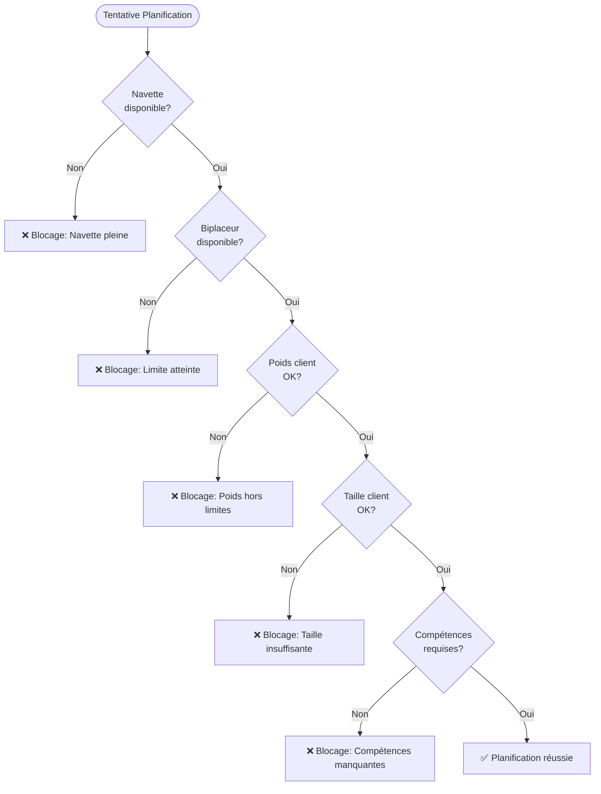
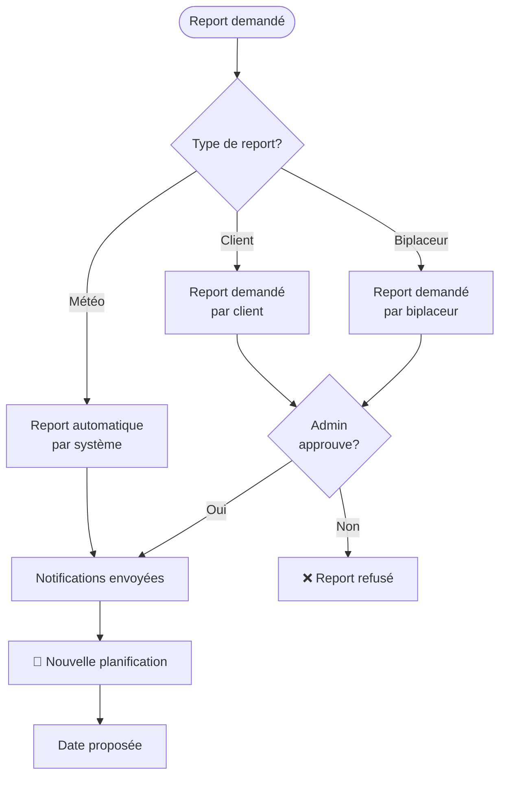

# 📊 Analyse du Document UX_WORKFLOW_DIAGRAM.md

## 🎯 Vue d'Ensemble

Analyse complète du document `UX_WORKFLOW_DIAGRAM.md` pour identifier les points forts, incohérences, erreurs et améliorations possibles.

**Date d'analyse** : 2024
**Version analysée** : 1.0.0

---

## ✅ Points Forts

1. **Structure claire et organisée**
   - Table des matières complète
   - Diagrammes Mermaid bien formatés
   - Schémas ASCII lisibles

2. **Couverture complète des fonctionnalités**
   - Workflow principal détaillé
   - Navettes et biplaceurs visualisés
   - Paiements en 3 étapes clairement expliqués
   - Notifications par rôle

3. **Visualisations pertinentes**
   - Diagrammes de séquence pour le workflow
   - Graphiques de répartition des ressources
   - Timeline des paiements
   - Planning jour avec exemples concrets

---

## ❌ Erreurs Identifiées

### 1. **Erreur de référence dans le diagramme mobile (Ligne 631)**

**Problème** : Référence incorrecte à `Client1` au lieu de `ClientInfo`

```mermaid
Flight1 --> ClientInfo[👤 Client A<br/>75kg, 1.75m<br/>Options: Photo]
Client1 --> Payment[💳 Paiement Final]  ❌ ERREUR: Client1 n'existe pas
```

**Correction nécessaire** :
```mermaid
Flight1 --> ClientInfo[👤 Client A<br/>75kg, 1.75m<br/>Options: Photo]
ClientInfo --> Payment[💳 Paiement Final]  ✅ CORRECT
```

---

## ⚠️ Incohérences avec le Code Existant

### 2. **Statuts de Réservation**

**Document UX** mentionne :
- `authorized`, `scheduled`, `rescheduled`, `completed`

**Code réel** (migration `create_reservations_table.php`) :
- `pending`, `authorized`, `scheduled`, `confirmed`, `completed`, `cancelled`, `rescheduled`, `refunded`

**Différence** : Le statut `confirmed` n'est pas mentionné dans les diagrammes, mais existe dans le code.

### 3. **Durée Standard de Rotation**

**Document UX** (ligne 532) :
- Rotation standard = 135 min (2h15)

**Blueprint original** :
- Durée standard = 1h30 (90 min)

**Incohérence** : Le document UX calcule 135 min mais le blueprint parle de 1h30. Il faut clarifier :
- 1h30 = durée totale incluant pause ?
- Ou 1h30 = juste rotation sans pause ?

**Recommandation** : Clarifier dans le document que :
- Rotation active : 1h30 (transport + vol + retour)
- Avec pause obligatoire : 2h minimum entre rotations

### 4. **Comptage des Places Navette**

**Document UX** :
- Mentionne "9 places max (chauffeur compris)"
- Mais dans les exemples, confusion entre :
  - "7/8 passagers" = clients + biplaceurs (sans compter chauffeur)
  - "9 places max" = total incluant chauffeur

**Exemple ligne 400** :
```
Passagers: 5 clients + 2 biplaceurs = 7/8  ❌ Ambigu
```

**Clarification nécessaire** :
- Capacité totale : 9 places (chauffeur inclus)
- Capacité passagers : 8 places (clients + biplaceurs)
- Notation : "6/8 passagers" signifie 6 passagers sur 8 possibles

---

## 🔍 Éléments Manquants

### 5. **Gestion de la Taille Client**

**Blueprint mentionne** :
- Taille minimale requise
- Vérification poids/taille pour sécurité

**Document UX** :
- ✅ Affiche poids et taille dans les exemples
- ❌ Ne montre pas la validation/contrainte de taille minimale
- ❌ Pas de diagramme de validation des contraintes sécurité

**Recommandation** : Ajouter un diagramme de validation des contraintes client.

### 6. **Gestion des Groupes/Familles**

**Blueprint mentionne** :
- Gestion de groupe ou famille
- Multivol

**Document UX** :
- ❌ Pas d'exemple de réservation groupe
- ❌ Pas de diagramme de répartition pour groupe

**Recommandation** : Ajouter une section "Gestion de Groupes" avec exemple.

### 7. **Codes Promo et Bons Cadeaux**

**Document UX** :
- Mentionnés dans le workflow principal
- ❌ Pas de diagramme dédié
- ❌ Pas d'exemple d'application

**Recommandation** : Ajouter un diagramme de flux pour l'application de codes promo/bons cadeaux.

### 8. **Signatures Électroniques**

**Code existant** :
- Table `signatures` existe
- Modèle `Signature` existe
- Migration créée

**Document UX** :
- ❌ Pas mentionné dans le workflow
- ❌ Pas de diagramme de signature

**Recommandation** : Ajouter l'étape de signature dans le workflow principal.

### 9. **Gestion Météo et Reports Automatiques**

**Blueprint mentionne** :
- Annulation automatique si conditions non favorables
- Reports météo

**Document UX** :
- ✅ Mentionne reports météo dans notifications
- ❌ Pas de diagramme de workflow météo
- ❌ Pas de logique d'annulation automatique illustrée

**Recommandation** : Ajouter un diagramme "Workflow Météo" avec décision automatique.

### 10. **Gestion des Remplacements Biplaceur**

**Blueprint mentionne** :
- Remplacement biplaceur indisponible
- Ajustement navette et notifications automatiques

**Document UX** :
- ❌ Pas de diagramme de remplacement
- ❌ Pas de workflow de réassignation

**Recommandation** : Ajouter un diagramme "Remplacement Biplaceur".

### 11. **Statut `confirmed` Manquant**

**Code existant** :
- Statut `confirmed` dans la migration
- Différent de `scheduled`

**Document UX** :
- ❌ Ne mentionne pas le statut `confirmed`
- ❌ Pas de distinction entre `scheduled` et `confirmed`

**Clarification nécessaire** :
- `scheduled` = Date assignée par admin
- `confirmed` = Confirmé par le client (après notification)

---

## 📝 Améliorations Suggérées

### 12. **Tableau de Contraintes Complet**

Créer un tableau récapitulatif des contraintes :

| Contrainte | Valeur | Validation | Blocage |
|-----------|--------|------------|---------|
| Navette capacité | 9 places (8 passagers) | Automatique | Si plein |
| Biplaceur limite | 5 vols/jour | Automatique | Si atteint |
| Poids client min | 40kg | À la réservation | Si < 40kg |
| Poids client max | 120kg | À la réservation | Si > 120kg |
| Taille client min | 1,40m | À la réservation | Si < 1,40m |
| Rotation durée | 1h30 + pause 30min | Calcul auto | - |
| Pause biplaceur | 30 min minimum | Entre rotations | - |

### 13. **Diagramme de Validation des Contraintes**

Ajouter un diagramme de décision pour la validation des contraintes lors de la planification :



### 14. **Diagramme de Gestion des Reports**

Ajouter un workflow complet pour les reports :



### 15. **Section "Gestion de Groupes"**

Ajouter un exemple de réservation groupe :

```
┌─────────────────────────────────────────────────────────────────┐
│                    RÉSERVATION GROUPE                            │
├─────────────────────────────────────────────────────────────────┤
│  Groupe: Famille Martin (4 personnes)                            │
│  Responsable: Jean Martin (père)                                 │
│                                                                  │
│  Participants:                                                  │
│  ┌──────────────────────────────────────────────────────────┐ │
│  │ 1. Jean Martin      │ 75kg │ 1.80m │ Options: Photo      │ │
│  │ 2. Marie Martin    │ 65kg │ 1.70m │ Options: Vidéo      │ │
│  │ 3. Paul Martin     │ 45kg │ 1.45m │ (enfant, accompagné) │ │
│  │ 4. Sophie Martin   │ 42kg │ 1.42m │ (enfant, accompagné) │ │
│  └──────────────────────────────────────────────────────────┘ │
│                                                                  │
│  Répartition:                                                   │
│  - Navette 1: Jean + Marie + Biplaceur 1                        │
│  - Navette 1: Paul + Sophie + Biplaceur 2 (spécialisé enfants) │
│                                                                  │
│  Remise groupe: -10% sur le total                               │
│  Paiement: Empreinte bancaire groupée                           │
└─────────────────────────────────────────────────────────────────┘
```

### 16. **Workflow Signatures Électroniques**

Ajouter dans le workflow principal :

```
Jour du vol - Avant le vol
├─ Biplaceur vérifie signature
├─ Si non signée → Demande signature
│  ├─ Client signe sur tablette
│  ├─ Hash de vérification généré
│  └─ Fichier signature sauvegardé
└─ Si déjà signée → Vérification hash
```

### 17. **Clarification Paiements Intermédiaires**

Le document mentionne "Paiement intermédiaire" mais il faut clarifier :

**Option A** : Paiement immédiat pour options ajoutées
- Client ajoute options → Paiement immédiat requis
- Type: `intermediate_payment` avec capture immédiate

**Option B** : Paiement différé pour options
- Client ajoute options → Montant ajouté au total
- Capture différée au jour du vol

**Recommandation** : Préciser dans le document quelle option est utilisée.

---

## 🔧 Corrections à Apporter

### Priorité Haute

1. ✅ **Corriger la référence `Client1` → `ClientInfo`** (ligne 631)
2. ✅ **Clarifier le comptage des places navette** (ligne 400, 416, etc.)
3. ✅ **Ajouter le statut `confirmed`** dans les diagrammes
4. ✅ **Corriger la durée rotation** : 1h30 vs 2h15

### Priorité Moyenne

5. ✅ **Ajouter diagramme validation contraintes**
6. ✅ **Ajouter workflow signatures électroniques**
7. ✅ **Ajouter workflow gestion météo/reports**
8. ✅ **Ajouter section gestion groupes**

### Priorité Basse

9. ✅ **Ajouter diagramme codes promo/bons cadeaux**
10. ✅ **Ajouter workflow remplacement biplaceur**
11. ✅ **Créer tableau récapitulatif contraintes**

---

## 📊 Métriques de Qualité

| Critère | Score | Commentaire |
|---------|-------|-------------|
| **Complétude** | 75% | Manque quelques workflows (signatures, groupes, météo) |
| **Cohérence avec code** | 85% | Quelques incohérences mineures (statuts, durées) |
| **Clarté visuelle** | 90% | Diagrammes clairs et bien formatés |
| **Précision** | 80% | Quelques ambiguïtés (places navette, durées) |
| **Utilité** | 90% | Très utile pour comprendre le système global |

**Score Global** : **84%** ✅

---

## 🎯 Recommandations Finales

1. **Corriger les erreurs** identifiées (priorité haute)
2. **Clarifier les ambiguïtés** (comptage places, durées)
3. **Ajouter les workflows manquants** (signatures, groupes, météo)
4. **Synchroniser avec le code** (statuts, champs)
5. **Créer un index des contraintes** pour référence rapide

---

**Document créé** : Analyse complète du document UX_WORKFLOW_DIAGRAM.md
**Version** : 1.0.0
**Date** : 2024

