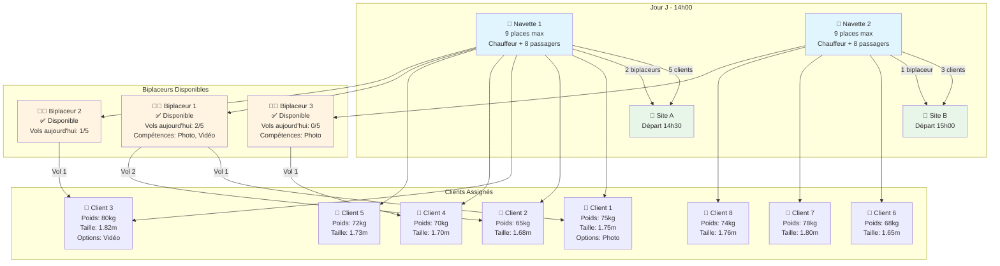
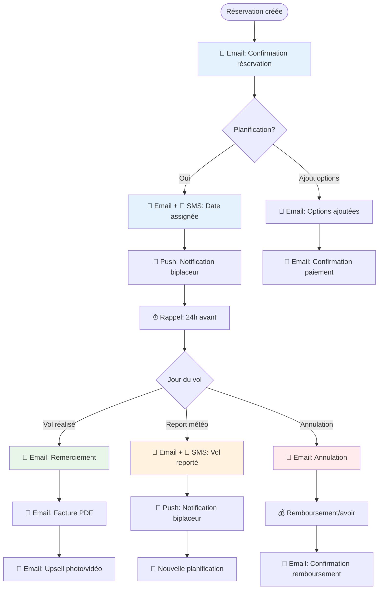
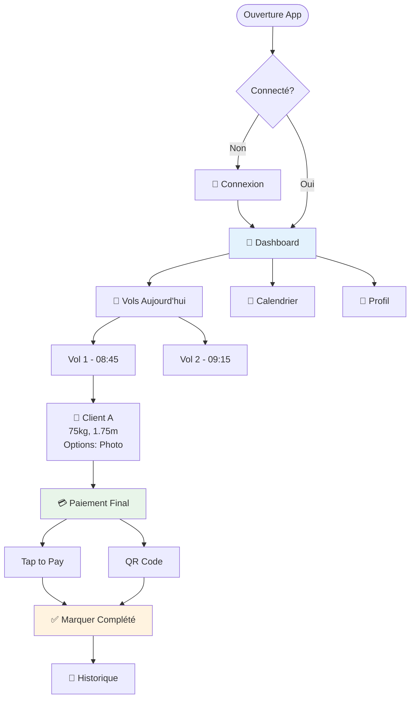

# 🎨 Schémas Graphiques UX - Système de Gestion Parapente

Ce document contient tous les schémas graphiques visuels pour comprendre le workflow complet du système, incluant les navettes, biplaceurs, clients, rotations, paiements et notifications.

---

## 📊 Table des Matières

1. [Workflow Complet](#1-workflow-complet)
2. [Diagramme Navettes & Biplaceurs](#2-diagramme-navettes--biplaceurs)
3. [Timeline des Paiements](#3-timeline-des-paiements)
4. [Flux de Notifications](#4-flux-de-notifications)
5. [Vue Planning Jour](#5-vue-planning-jour)
6. [Diagramme de Rotations](#6-diagramme-de-rotations)

---

## 1. Workflow Complet

### Diagramme de Séquence Principal

```mermaid
sequenceDiagram
    participant C as Client
    participant S as Système
    participant P as PaymentService
    participant N as NotificationService
    participant A as Admin
    participant B as Biplaceur
    participant Nav as Navette

    C->>S: 1. Réservation (sans date)
    Note over C,S: Formulaire: nom, email, poids, taille, options
    S->>P: 2. Créer PaymentIntent
    P-->>S: PaymentIntent créé
    S->>C: 3. Redirection Stripe
    C->>P: 4. Paiement initial/acompte
    P-->>S: 5. Confirmation paiement
    S->>S: 6. Statut = "authorized"
    S->>N: 7. Envoyer confirmation
    N->>C: 📧 Email confirmation

    Note over A: Planification par Admin
    A->>S: 8. Assigner date/biplaceur/navette
    S->>S: 9. Vérifier contraintes
    Note over S: - Capacité navette (9 places total: 8 passagers + 1 chauffeur)<br/>- Disponibilité biplaceur<br/>- Limite vols/jour biplaceur (5 max)<br/>- Poids/taille client (min 40kg, taille min 1.40m)<br/>- Compétences biplaceur pour options
    S->>S: 10. Statut = "scheduled" (ou "confirmed" si client confirme)
    S->>N: 11. Notifications
    N->>C: 📧 Email + 📱 SMS
    N->>B: 📱 Notification push

    opt Ajout d'options
        C->>S: 12. Ajouter options
        S->>P: 13. Créer PaymentIntent complémentaire
        C->>P: 14. Paiement intermédiaire
        P-->>S: 15. Confirmation
        S->>N: 16. Notification options ajoutées
        N->>C: 📧 Email confirmation
    end

    Note over B: Jour du vol
    B->>S: 17. Consulter planning du jour
    S-->>B: 18. Liste vols avec infos clients
    B->>C: 19. Rencontre au point de départ
    B->>Nav: 20. Embarquement navette
    
    Note over Nav,B,C: Rotation navette
    Nav->>Nav: 21. Transport vers site
    B->>C: 22. Vol parapente
    Nav->>Nav: 23. Retour base
    
    Note over B: Après le vol
    B->>S: 24. Marquer vol "completed"
    B->>P: 25. Paiement final sur place (Tap to Pay/QR)
    P-->>S: 26. Capture paiement
    S->>S: 27. Statut = "completed"
    S->>N: 28. Notifications post-vol
    N->>C: 📧 Email remerciement + facture
    N->>B: 📱 Confirmation encaissement
```

---

## 2. Diagramme Navettes & Biplaceurs

### Vue d'Ensemble - Répartition des Ressources



### Répartition Automatique avec Contraintes

```
┌─────────────────────────────────────────────────────────────────┐
│                    SYSTÈME DE RÉPARTITION                       │
└─────────────────────────────────────────────────────────────────┘

┌──────────────────┐      ┌──────────────────┐      ┌──────────────────┐
│   NAVETTE 1      │      │   NAVETTE 2      │      │   NAVETTE 3      │
│   Capacité: 9    │      │   Capacité: 9    │      │   Capacité: 9    │
│   Restant: 3     │      │   Restant: 5     │      │   Restant: 9     │
└──────────────────┘      └──────────────────┘      └──────────────────┘
         │                        │                        │
         ├─ Chauffeur (1)         ├─ Chauffeur (1)         ├─ Chauffeur (1)
         ├─ Biplaceur 1 (1)       ├─ Biplaceur 2 (1)      ├─ (disponible)
         ├─ Client A (1)          ├─ Client D (1)          │
         ├─ Client B (1)          ├─ Client E (1)          │
         ├─ Client C (1)          ├─ Client F (1)          │
         └─ (3 places libres)     └─ (5 places libres)     └─ (8 places libres)

┌─────────────────────────────────────────────────────────────────┐
│                    CONTRAINTES RESPECTÉES                        │
├─────────────────────────────────────────────────────────────────┤
│ ✅ Poids total navette 1: 380kg < 450kg max                     │
│ ✅ Poids total navette 2: 290kg < 450kg max                     │
│ ✅ Biplaceur 1: 2 vols aujourd'hui < 5 max                      │
│ ✅ Biplaceur 2: 1 vol aujourd'hui < 5 max                       │
│ ✅ Rotation durée: ~1h30 (navette + vol + retour)               │
│ ✅ Compétences: Photo disponible pour Client A (Biplaceur 1)     │
└─────────────────────────────────────────────────────────────────┘
```

---

## 3. Timeline des Paiements

### Schéma Temporel des Paiements

```mermaid
gantt
    title Timeline Paiements - Réservation Complète
    dateFormat X
    axisFormat %s
    
    section Réservation Initiale
    Paiement initial/acompte    :milestone, m1, 0, 0d
    Empreinte bancaire          :done, d1, 0, 0d
    
    section Planification
    Assignation date            :milestone, m2, 86400, 0d
    Notification client         :done, d2, 86400, 0d
    
    section Options Intermédiaires
    Ajout options photo         :milestone, m3, 172800, 0d
    Paiement intermédiaire      :done, d3, 172800, 0d
    
    section Jour du Vol
    Vol réalisé                 :milestone, m4, 604800, 0d
    Paiement final sur place    :crit, d4, 604800, 0d
    Capture paiement            :done, d5, 604850, 0d
    
    section Post-Vol
    Facture envoyée             :done, d6, 604860, 0d
```



### Détail des Flux de Paiement

```
┌─────────────────────────────────────────────────────────────────────┐
│                    FLUX DE PAIEMENTS                                 │
└─────────────────────────────────────────────────────────────────────┘

┌─────────────────────────────────────────────────────────────────────┐
│  ÉTAPE 1: RÉSERVATION INITIALE                                      │
├─────────────────────────────────────────────────────────────────────┤
│  Client remplit formulaire → Montant total: 120€                    │
│                                                                      │
│  Options de paiement:                                               │
│  ┌──────────────────────────────────────────────────────────────┐  │
│  │ Option A: Acompte (30%)                                      │  │
│  │   → Paiement immédiat: 36€                                   │  │
│  │   → Reste à payer: 84€                                      │  │
│  │                                                              │  │
│  │ Option B: Empreinte bancaire (100%)                          │  │
│  │   → Authorization: 120€ (non capturé)                        │  │
│  │   → Capture différée après vol                               │  │
│  └──────────────────────────────────────────────────────────────┘  │
│                                                                      │
│  Résultat: Statut = "authorized"                                   │
│  PaymentIntent créé avec capture_method: "manual"                  │
└─────────────────────────────────────────────────────────────────────┘

┌─────────────────────────────────────────────────────────────────────┐
│  ÉTAPE 2: AJOUT D'OPTIONS (Optionnel)                               │
├─────────────────────────────────────────────────────────────────────┤
│  Client ajoute: Photo (20€) + Vidéo (30€) = +50€                   │
│                                                                      │
│  Nouveau PaymentIntent créé:                                        │
│  ┌──────────────────────────────────────────────────────────────┐  │
│  │ Montant: 50€                                                 │  │
│  │ Type: "intermediate_payment"                                 │  │
│  │ Capture: immédiate                                           │  │
│  └──────────────────────────────────────────────────────────────┘  │
│                                                                      │
│  Résultat: Total payé = 86€ (36€ + 50€)                            │
│            Reste à payer = 84€ (si acompte initial)                │
│            ou 120€ (si empreinte initiale)                         │
└─────────────────────────────────────────────────────────────────────┘

┌─────────────────────────────────────────────────────────────────────┐
│  ÉTAPE 3: PAIEMENT FINAL SUR PLACE                                  │
├─────────────────────────────────────────────────────────────────────┤
│  Jour du vol - Sur le site                                          │
│                                                                      │
│  Méthodes disponibles:                                              │
│  ┌──────────────────────────────────────────────────────────────┐  │
│  │ 1. Stripe Terminal (Tap to Pay / NFC)                        │  │
│  │    → Biplaceur utilise terminal mobile                       │  │
│  │    → Paiement sécurisé instantané                            │  │
│  │                                                              │  │
│  │ 2. QR Code Checkout                                          │  │
│  │    → Client scanne QR code                                   │  │
│  │    → Paiement via navigateur                                 │  │
│  │                                                              │  │
│  │ 3. Lien de paiement                                          │  │
│  │    → Envoyé par SMS/Email                                    │  │
│  │    → Client paie via lien                                    │  │
│  └──────────────────────────────────────────────────────────────┘  │
│                                                                      │
│  Montant final: 84€ (reste à payer)                                │
│  Capture automatique de l'authorization initiale ou nouveau PI     │
│                                                                      │
│  Résultat: Statut = "completed"                                    │
│            Facture PDF générée et envoyée                          │
└─────────────────────────────────────────────────────────────────────┘
```

---

## 4. Flux de Notifications

### Diagramme de Notifications Automatiques



### Détail des Notifications par Rôle

```
┌─────────────────────────────────────────────────────────────────────┐
│                    NOTIFICATIONS CLIENT                             │
├─────────────────────────────────────────────────────────────────────┤
│  📧 Email: Confirmation réservation                                  │
│     └─ Contenu: Numéro réservation, montant payé, prochaines étapes │
│                                                                      │
│  📧 Email + 📱 SMS: Date assignée                                    │
│     └─ Contenu: Date, heure, lieu, biplaceur, préparations         │
│                                                                      │
│  📧 Email: Options ajoutées                                          │
│     └─ Contenu: Détail options, nouveau montant, lien paiement      │
│                                                                      │
│  ⏰ Rappel: 24h avant le vol                                         │
│     └─ Contenu: Rappel rendez-vous, météo, checklist                │
│                                                                      │
│  📧 Email: Vol reporté (météo)                                       │
│     └─ Contenu: Raison, nouvelle date proposée, instructions         │
│                                                                      │
│  📧 Email: Remerciement post-vol                                     │
│     └─ Contenu: Message personnalisé, lien avis, facture             │
│                                                                      │
│  📧 Email: Upsell photo/vidéo                                        │
│     └─ Contenu: Offre spéciale, photos du vol, lien achat           │
└─────────────────────────────────────────────────────────────────────┘

┌─────────────────────────────────────────────────────────────────────┐
│                    NOTIFICATIONS BIPLACEUR                          │
├─────────────────────────────────────────────────────────────────────┤
│  📱 Push: Nouvelle assignation                                       │
│     └─ Contenu: Client, date, heure, site, infos client              │
│                                                                      │
│  📱 Push: Planning du jour                                           │
│     └─ Contenu: Liste vols, horaires, clients, options               │
│                                                                      │
│  📱 Push: Vol reporté                                                │
│     └─ Contenu: Réservation, nouvelle date, raison                   │
│                                                                      │
│  📱 Push: Rappel vol proche                                          │
│     └─ Contenu: Vol dans 2h, client, lieu                            │
│                                                                      │
│  📱 Push: Confirmation encaissement                                  │
│     └─ Contenu: Paiement reçu, montant, réservation                  │
└─────────────────────────────────────────────────────────────────────┘

┌─────────────────────────────────────────────────────────────────────┐
│                    NOTIFICATIONS ADMIN                              │
├─────────────────────────────────────────────────────────────────────┤
│  📧 Email: Nouvelle réservation                                      │
│     └─ Contenu: Client, montant, options, à planifier               │
│                                                                      │
│  📧 Email: Réservation à planifier                                   │
│     └─ Contenu: Liste réservations sans date assignée                │
│                                                                      │
│  📧 Email: Alerte contraintes                                        │
│     └─ Contenu: Navette pleine, biplaceur limite atteinte            │
│                                                                      │
│  📧 Email: Rapport quotidien                                         │
│     └─ Contenu: CA du jour, vols réalisés, annulations                │
└─────────────────────────────────────────────────────────────────────┘
```

---

## 5. Vue Planning Jour

### Calendrier Visuel - Exemple Journée

```
┌─────────────────────────────────────────────────────────────────────────┐
│                    PLANNING JOUR - 15 Juillet 2024                      │
└─────────────────────────────────────────────────────────────────────────┘

┌─────────────────────────────────────────────────────────────────────────┐
│  NAVETTE 1 🚐 (9 places max)                                            │
├─────────────────────────────────────────────────────────────────────────┤
│  08:00 │ [DÉPART BASE]                                                    │
│        │ Chauffeur: Jean                                                  │
│        │ Passagers: 5 clients + 2 biplaceurs = 7/8 (8 max passagers)      │
│        │                                                                  │
│  08:30 │ [ARRIVÉE SITE A]                                                 │
│        │                                                                  │
│  08:45 │ [VOL 1] Biplaceur 1 + Client A (75kg, Photo)                    │
│        │                                                                  │
│  09:15 │ [VOL 2] Biplaceur 1 + Client B (65kg)                           │
│        │                                                                  │
│  09:45 │ [VOL 3] Biplaceur 2 + Client C (80kg, Vidéo)                    │
│        │                                                                  │
│  10:15 │ [RETOUR BASE]                                                    │
│        │ Rotation terminée                                                │
│        │                                                                  │
│  10:30 │ [PAUSE OBLIGATOIRE] 30 min minimum                              │
│        │                                                                  │
│  11:00 │ [DÉPART BASE] Rotation 2                                        │
│        │ Passagers: 3 clients + 1 biplaceur = 4/8 (8 max passagers)       │
│        │                                                                  │
│  11:30 │ [ARRIVÉE SITE B]                                                 │
│        │                                                                  │
│  12:00 │ [VOL 4] Biplaceur 2 + Client D (70kg)                           │
│        │                                                                  │
│  12:30 │ [RETOUR BASE]                                                    │
│        │                                                                  │
│  13:00 │ [PAUSE DÉJEUNER] 1h minimum                                     │
└─────────────────────────────────────────────────────────────────────────┘

┌─────────────────────────────────────────────────────────────────────────┐
│  NAVETTE 2 🚐 (9 places max)                                            │
├─────────────────────────────────────────────────────────────────────────┤
│  09:00 │ [DÉPART BASE]                                                    │
│        │ Chauffeur: Marie                                                 │
│        │ Passagers: 3 clients + 1 biplaceur = 4/8 (8 max passagers)      │
│        │                                                                  │
│  09:30 │ [ARRIVÉE SITE C]                                                 │
│        │                                                                  │
│  10:00 │ [VOL 1] Biplaceur 3 + Client E (72kg)                           │
│        │                                                                  │
│  10:30 │ [VOL 2] Biplaceur 3 + Client F (68kg, Photo)                   │
│        │                                                                  │
│  11:00 │ [RETOUR BASE]                                                    │
│        │                                                                  │
│  11:30 │ [DÉPART BASE] Rotation 2                                        │
│        │ Passagers: 2 clients = 2/8 (8 max passagers)                    │
│        │                                                                  │
│  12:00 │ [ARRIVÉE SITE A]                                                 │
│        │                                                                  │
│  12:30 │ [VOL 3] Biplaceur 3 + Client G (78kg)                           │
│        │                                                                  │
│  13:00 │ [RETOUR BASE]                                                    │
└─────────────────────────────────────────────────────────────────────────┘

┌─────────────────────────────────────────────────────────────────────────┐
│                    STATISTIQUES DU JOUR                                 │
├─────────────────────────────────────────────────────────────────────────┤
│  ✅ Vols planifiés: 7                                                    │
│  ✅ Vols réalisés: 6                                                    │
│  ❌ Vols reportés: 1 (météo)                                            │
│  💰 Chiffre d'affaires: 840€                                            │
│  👥 Clients total: 7                                                     │
│  👨‍✈️ Biplaceurs actifs: 3                                               │
│  🚐 Navettes utilisées: 2                                               │
└─────────────────────────────────────────────────────────────────────────┘
```

---

## 6. Diagramme de Rotations

### Vue Détaillée d'une Rotation Complète

```mermaid
graph LR
    subgraph "Base"
        B1[Base<br/>Départ]
    end
    
    subgraph "Navette"
        N1[Transport<br/>30 min]
    end
    
    subgraph "Site de Décolage"
        S1[Arrivée Site]
        S2[Préparation<br/>15 min]
        S3[Décolage]
        S4[Vol<br/>15-30 min]
        S5[Atterrissage]
        S6[Récupération<br/>10 min]
    end
    
    subgraph "Retour"
        R1[Transport Retour<br/>30 min]
        R2[Arrivée Base]
    end
    
    B1 -->|08:00| N1
    N1 -->|08:30| S1
    S1 --> S2
    S2 -->|08:45| S3
    S3 --> S4
    S4 -->|09:00| S5
    S5 --> S6
    S6 -->|09:15| R1
    R1 -->|09:45| R2
    
    style B1 fill:#e3f2fd
    style S4 fill:#e8f5e9
    style R2 fill:#fff3e0
```



### Calcul Automatique des Créneaux

```
┌─────────────────────────────────────────────────────────────────────┐
│                    CALCUL AUTOMATIQUE DES CRÉNEAUX                  │
└─────────────────────────────────────────────────────────────────────┘

Variables:
  - Durée transport aller: 30 min
  - Durée préparation: 15 min
  - Durée vol: 15-30 min (selon option)
  - Durée récupération: 10 min
  - Durée transport retour: 30 min
  - Pause entre rotations: 30 min minimum

Formule:
  Durée rotation active = Transport aller + Préparation + Vol + 
                          Récupération + Transport retour
  Durée totale = Durée rotation active + Pause obligatoire

Exemple:
  Rotation standard (vol 20 min):
  Rotation active = 30 + 15 + 20 + 10 + 30 = 105 min (1h45)
  Avec pause 30 min = 135 min (2h15) total
  
  Rotation avec option durée (vol 30 min):
  Rotation active = 30 + 15 + 30 + 10 + 30 = 115 min (1h55)
  Avec pause 30 min = 145 min (2h25) total

Note: Le blueprint mentionne "1h30 standard" = rotation active moyenne

Créneaux disponibles (journée 8h-18h = 10h = 600 min):
  - Avec rotation standard: 600 / 135 = 4 rotations max
  - Avec rotation durée: 600 / 145 = 4 rotations max

Optimisation:
  Si navettes multiples → Créneaux parallèles
  Si biplaceurs multiples → Vols simultanés sur même site
```

---

## 7. Vue Dashboard Admin

### Interface Visuelle du Tableau de Bord

```
┌─────────────────────────────────────────────────────────────────────────┐
│                    TABLEAU DE BORD ADMIN                               │
└─────────────────────────────────────────────────────────────────────────┘

┌─────────────────────────┬─────────────────────────┬───────────────────┐
│  📊 RÉSUMÉ GLOBAL       │  💰 CHIFFRE D'AFFAIRES   │  📅 AUJOURD'HUI   │
├─────────────────────────┼─────────────────────────┼───────────────────┤
│  Réservations: 45       │  Ce mois: 12,450€       │  Vols: 12        │
│  En attente: 8          │  Cette semaine: 3,200€   │  Reportés: 2     │
│  Planifiées: 32         │  Aujourd'hui: 840€      │  Annulés: 1      │
│  Complétées: 28         │  En attente: 1,200€     │  CA: 840€        │
└─────────────────────────┴─────────────────────────┴───────────────────┘

┌─────────────────────────────────────────────────────────────────────────┐
│  📅 PLANNING JOUR - 15 Juillet 2024                                    │
├─────────────────────────────────────────────────────────────────────────┤
│                                                                          │
│  ┌──────────┬──────────┬──────────┬──────────┬──────────┬──────────┐  │
│  │  08:00   │  09:00   │  10:00   │  11:00   │  12:00   │  13:00   │  │
│  ├──────────┼──────────┼──────────┼──────────┼──────────┼──────────┤  │
│  │ Navette1 │ Navette1 │ Navette1 │ Navette1 │ Navette1 │ Navette1 │  │
│  │ [5 cl]   │ [Vol 1]  │ [Vol 2]  │ [Retour] │ [Pause]  │ [Départ] │  │
│  │          │          │          │          │          │          │  │
│  │ Navette2 │ Navette2 │ Navette2 │ Navette2 │ Navette2 │          │  │
│  │ [3 cl]   │ [Vol 1]  │ [Vol 2]  │ [Retour] │ [Départ] │          │  │
│  └──────────┴──────────┴──────────┴──────────┴──────────┴──────────┘  │
│                                                                          │
└─────────────────────────────────────────────────────────────────────────┘

┌─────────────────────────────────────────────────────────────────────────┐
│  👨‍✈️ BIPLACEURS                                                        │
├─────────────────────────────────────────────────────────────────────────┤
│  Biplaceur 1: ✅ Actif    │ Vols aujourd'hui: 2/5  │ Disponibilité: OK │
│  Biplaceur 2: ✅ Actif    │ Vols aujourd'hui: 1/5  │ Disponibilité: OK │
│  Biplaceur 3: ✅ Actif    │ Vols aujourd'hui: 0/5  │ Disponibilité: OK │
│  Biplaceur 4: ⚠️ Limite   │ Vols aujourd'hui: 5/5  │ Indisponible     │
└─────────────────────────────────────────────────────────────────────────┘

┌─────────────────────────────────────────────────────────────────────────┐
│  🚐 NAVETTES                                                            │
├─────────────────────────────────────────────────────────────────────────┤
│  Navette 1: ✅ En service │ Places: 3/9 libres    │ Rotation: 2/4     │
│  Navette 2: ✅ En service │ Places: 5/9 libres    │ Rotation: 1/4     │
│  Navette 3: ⏸️ En réserve  │ Places: 9/9 libres    │ Disponible       │
└─────────────────────────────────────────────────────────────────────────┘

┌─────────────────────────────────────────────────────────────────────────┐
│  ⚠️ ALERTES                                                             │
├─────────────────────────────────────────────────────────────────────────┤
│  🔴 Navette 1: Presque pleine (6/9)                                    │
│  🟡 Biplaceur 4: Limite de vols atteinte                               │
│  🟢 Météo: Conditions favorables                                       │
│  🟡 3 réservations en attente de planification                         │
└─────────────────────────────────────────────────────────────────────────┘
```

---

## 8. Workflow Mobile Biplaceur

### Application Mobile - Vue Biplaceur



---

## 📝 Notes Importantes

### Points Clés du Workflow

1. **Flexibilité Paiements**
   - Acompte initial (30-50% configurable)
   - Paiement intermédiaire pour options (capture immédiate)
   - Paiement final sur place (NFC/Tap to Pay, QR code, lien)

2. **Gestion Navettes**
   - Capacité maximale: 9 places total (8 passagers + 1 chauffeur)
   - Plusieurs navettes simultanées possibles
   - Calcul automatique des places restantes
   - Vérification poids total navette

3. **Gestion Biplaceurs**
   - Limite de vols par jour (5 max par défaut, configurable)
   - Pauses obligatoires entre rotations (30 min minimum)
   - Compétences requises pour certaines options (photo, vidéo)
   - Disponibilités personnalisées (jours/heures)

4. **Contraintes Clients**
   - Poids minimum: 40kg
   - Poids maximum: 120kg (selon biplaceur)
   - Taille minimum: 1.40m
   - Validation automatique à la réservation

5. **Statuts de Réservation**
   - `pending` : En attente d'assignation
   - `authorized` : Paiement autorisé (empreinte/acompte)
   - `scheduled` : Date assignée par admin
   - `confirmed` : Confirmé par le client
   - `completed` : Vol effectué
   - `rescheduled` : Reporté
   - `cancelled` : Annulé

6. **Notifications Automatiques**
   - Email pour chaque étape importante
   - SMS pour dates assignées et reports
   - Push notifications pour biplaceurs
   - Rappels automatiques 24h avant

7. **Contraintes Automatiques**
   - Blocage si navette pleine
   - Blocage si biplaceur limite atteinte
   - Blocage si contraintes client non respectées
   - Vérification poids/taille pour sécurité
   - Calcul automatique des créneaux disponibles
   - Validation compétences biplaceur pour options

---

**Document créé** : Schémas graphiques UX complets selon blueprint final
**Version** : 1.0.0
**Date** : 2024

